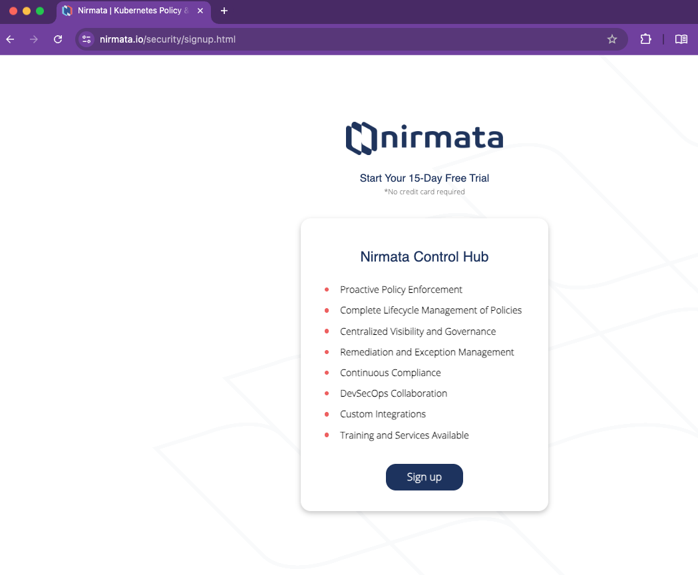
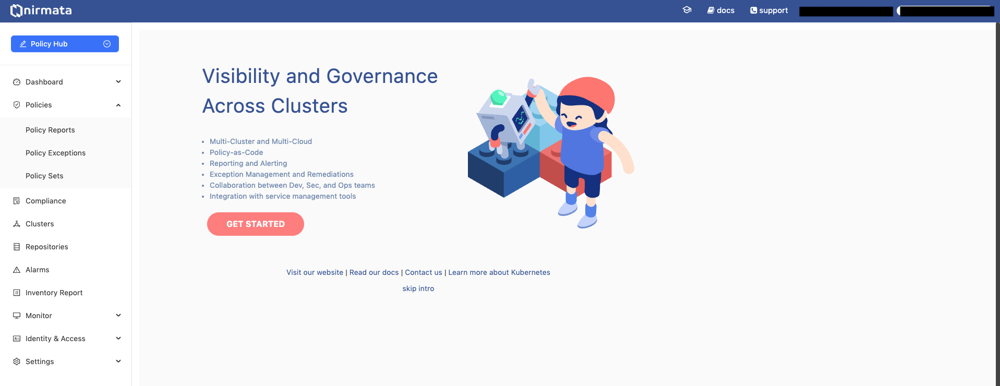
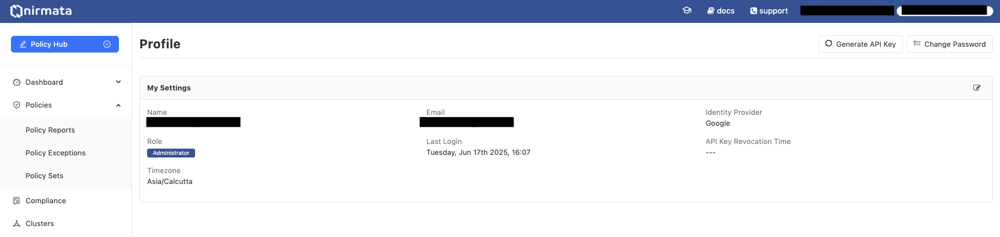

# EKS Best Practices Checks with Kyverno

This repository contains the implementation steps and configurations for deploying Nirmata Controller, Kyverno Operator, Cloud Controller and related components on Amazon EKS to enforce best practices and security policies.

## Prerequisites

- An AWS account with appropriate permissions
- `kubectl` installed and configured
- `helm` v3.x installed
- Access to an EKS cluster
- Access to try.nirmata.io
- Enable Pod Identity Addon

## Implementation Steps

### 1. Sign Up for Nirmata

1. Visit [try.nirmata.io](https://try.nirmata.io)

2. Complete the registration process
3. Follow the verification steps in your email
4. Log in to your Nirmata account


#### 1.1 Generate API key for the cluster regestration

1. Navigate to the User Profile [Profile](https://www.nirmata.io/webclient/#profile)
2. Click on the generate API Key button

3. Copy the generated API key and keep it for next steps. 


### 2. Deploy Required Components

#### 2.1 Deploy Nirmata Controller

```bash
# Add Nirmata Helm repository
helm repo add nirmata https://nirmata.github.io/kyverno-charts/
helm repo update

# Install Nirmata Controller
helm install nirmata-kube-controller nirmata/nirmata-kube-controller -n nirmata --create-namespace \
  --set nirmataURL=wss://www.nirmata.io/tunnels \
  --set cluster.name=<CLUSTER_NAME> \
  --set namespace=nirmata \
  --set isNpmOnly=false \
  --set apiToken=<API_TOKEN_FROM_STEP_1.1> \
  --set features.policyExceptions.enabled=true \
  --set features.policySets.enabled=true
```

#### 2.2 Deploy Kyverno Operator

```bash
# Install Kyverno Operator
helm install kyverno-operator nirmata/nirmata-kyverno-operator -n nirmata-system \
  --create-namespace \
  --set enablePolicyset=true
```

#### 2.3 Deploy Cloud Scanner

1. Create an IAM Role for Scanner Pods: Create an IAM role in the same account as the EKS cluster. Attach the following trust policy to allow the EKS Pod Identity Agent to assume the role

```bash
    {
  "Version": "2012-10-17",
  "Statement": [
    {
      "Sid": "AllowEksAuthToAssumeRoleForPodIdentity",
      "Effect": "Allow",
      "Principal": {
        "Service": "pods.eks.amazonaws.com"
      },
      "Action": [
        "sts:AssumeRole",
        "sts:TagSession"
      ]
    }
  ]
}

```
2. Attach a policy to the IAM role with the permissions required for scanning AWS resources.

```bash
    {
	"Version": "2012-10-17",
	"Statement": [
		{
			"Effect": "Allow",
			"Action": [
				"cloudformation:ListResources",
				"cloudformation:GetResource"
			],
			"Resource": "*"
		}
	]
}

```
Depending on which services you want to scan, provide the necessary read access (List* & Get*).

3. Create Pod Identity Association: Associate the IAM role created earlier with the existing service account cloud-controller-scanner in the nirmata namespace. Use the AWS CLI

```bash
aws eks create-pod-identity-association \
  --cluster-name <EKS_CLUSTER_NAME> \
  --role-arn <IAM_ROLE_ARN> \
  --namespace nirmata \
  --service-account cloud-controller-scanner
```

4. Deploy the Cloud Control Helm Chart:

Create a values.yaml file with the following information:
```bash
scanner:
  primaryAWSAccountConfig:
    accountID: "your-account-id"
    accountName: "cloud-control-demo"
    regions: ["us-west-1","us-east-1"] # insert any other regions
    services: ["EKS"] # insert services to scan

```

```bash

# Install AWS Cloud Controller
helm install cloud-controller nirmata/cloud-controller \ 
  --create-namespace \ 
  --namespace nirmata \ 
  -f values.yaml
```

5. Verify Installation

```bash
kubectl get pods -n nirmata
```
The output should display the running pods:
```bash
NAME                                                  READY   STATUS    RESTARTS   AGE
cloud-control-admission-controller-dfd7f69fd-jjhn5   1/1     Running   0          17d
cloud-control-reports-controller-7954bb477d-lb2ld    1/1     Running   0          17d
cloud-control-scanner-7756dc6ddf-qljbb               1/1     Running   0          17d
```


#### 2.5 Deploy Kyverno

```bash
# Install Kyverno
helm install kyverno nirmata/kyverno -n kyverno --create-namespace \
  --set features.policyExceptions.namespace="kyverno" \
  --set features.policyExceptions.enabled=true
```

### 3. Verify Deployments

```bash
# Check all deployments
kubectl get pods -n nirmata
kubectl get pods -n kyverno
kubectl get pods -n kube-system
```

## Additional Resources

- [Nirmata Documentation](https://docs.nirmata.com)
- [Kyverno Documentation](https://kyverno.io/docs/)
- [AWS EKS Documentation](https://docs.aws.amazon.com/eks/)

## Troubleshooting

If you encounter any issues during the deployment:

1. Check the pod status using `kubectl get pods`
2. View pod logs using `kubectl logs <pod-name> -n <namespace>`
3. Ensure all prerequisites are met
4. Verify AWS credentials and permissions
5. Check network connectivity to required services

## Support

For additional support:
- Nirmata Support: [support@nirmata.com](mailto:support@nirmata.com)
- Kyverno GitHub Issues: [Kyverno Issues](https://github.com/kyverno/kyverno/issues)
